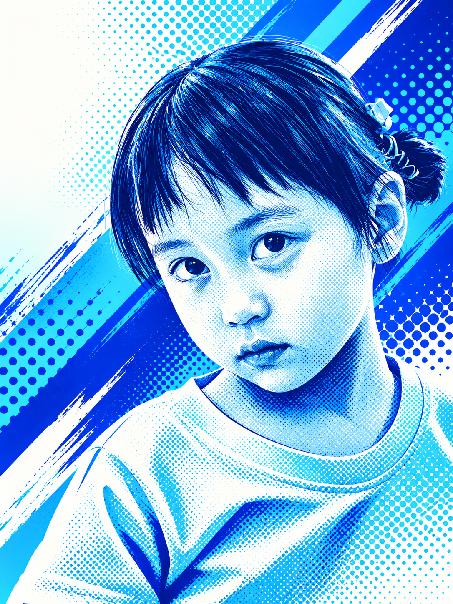

# jwan-electric-blue-poster

Jwan electric-blue halftone portrait diptych Skill.

## Features

- Preserve the supplied portrait in the upper half of a vertical 9:16 image.
- Create a centered electric-blue halftone portrait below with clean negative space.
- Keep the subject legible and avoid unwanted halos, clutter, or pseudo-text.

## Case

## Usage

Use `$jwan-electric-blue-poster` followed by one portrait photo. Add optional instructions for color intensity or signature.

## Repository structure

- `SKILL.md` — complete Skill definition
- `examples/` — generated case images
- `README.md` — usage and project notes
- `LICENSE` — MIT license for this Jwan adaptation

## Attribution

This is a Jwan-specific adaptation inspired by [Wibi Style electric-blue-halftone-poster](https://github.com/Vieeeeeee/wibi-style/tree/main/skills/electric-blue-halftone-poster). Review the source repository for its original attribution and license terms.

## License

Jwan-authored material in this repository is released under the MIT License. See `LICENSE`.
